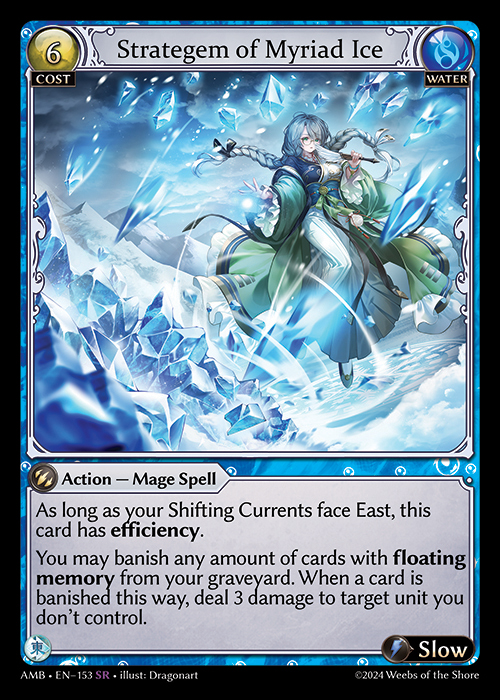

# Abilities - Triggered Abilities

Triggered abilities are abilities placed into the Effects Stack by a player during state-based checks due to fulfillment of a game event or condition (i.e., the “trigger”). Resolution of triggered abilities will cause the effect specified after the trigger to take effect. Triggered abilities whose effects use the word “may” are an exception to this; the player who controls the trigger is often given a choice as to which effect, if any, were to happen during resolution.

Trigger abilities generally use the words “At,” “When,” or “Whenever,” to specify a triggering event, followed by (optionally) an intervening condition or “if” statement, and ultimately an effect. Triggered abilities can be keyworded where the conditions and triggering events are shortened within the keyword, but will typically be absent of any intervening conditions. As such, keyworded triggered abilities will trigger as long as the keyword-bound condition is met, regardless of any further specified conditions listed in the effect(s) of the ability.

1. Triggered abilities are generally worded as “\[Trigger], \[Condition], \[Effect]. A \[Condition] can further modify the main trigger and typically uses words such as “If” or “Unless.” For non-keyworded triggered abilities, the ability will fail to trigger if this condition is not satisfied in addition to the triggering event; it will never be placed onto the effects stack to pend resolution. Additionally, if such a condition was specified and fulfilled such that the trigger entered the Effects Stack, the trigger will not resolve if the condition is unmet during resolution.
2. Some triggered abilities are conditionally triggered abilities which will describe a condition that must be satisfied followed by the effect which will be placed onto the Effects Stack when the trigger condition is met. Conditionally triggered abilities typically use keywords such as On Enter and are worded as “\[Trigger/Trigger Condition] : \[Effect]”. These conditions will typically be present for common events or uncomplicated conditions, such as On Enter, On Attack, or On Death.


E.g., Lorraine, Wandering Warrior has “On Enter: Materialize a weapon card with memory cost 0 from your material deck.” The “On Enter” is a conditionally triggered ability that will place the effect of “Materialize a weapon card with memory cost 0 from your material deck” onto the Effects Stack when the trigger condition is met.



3. For each case, the trigger or trigger condition must be fulfilled for the trigger to enter the Effects Stack.

These abilities follow the resolution conventions the same way activated abilities do after they are placed into the Effects Stack.

If a triggered ability asks that a player choose a mode, that mode is chosen as the ability enters the Effects Stack and can’t be changed while it is there. If there are no legal modes that can be chosen, the ability will fizzle. Similarly, if a triggered ability requires a target, that target must be selected as it is placed onto the effects stack. If no legal targets are available, the ability will fizzle.

Some triggered abilities are delayed trigger abilities, which can generate delayed triggers that cause the ability to enter the Effects Stack at a later time, such as at the end of a turn. They may also use words such as “At” or “When,” but may not necessarily start with those words.

4. Delayed triggers are generated as a result of the resolution of another ability. If the original ability that would generate the delayed trigger is negated or fizzles, the delayed trigger will not be generated.
5. Delayed triggers only happen once, like normal triggered abilities. If the trigger fails at the next possible opportunity, it will not generate another delayed trigger to attempt resolving again.
6. Delayed triggered abilities are still considered abilities and may be negated or fizzled.

When multiple triggered abilities enter the Effects Stack simultaneously, they will be stacked in turn order starting with the abilities that belong to the turn player. Each player will be able to select which order their own abilities will enter the Effects Stack when it is their turn to place their abilities into the Effects Stack. Only after each triggered ability is placed into the Effects Stack this way will the turn player be granted Opportunity and the triggered abilities will have a chance to resolve after the sequential passing of Opportunity.

If a trigger is generated while another effect or activation is resolving, the trigger will be placed onto the Effects Stack only after that effect/activation is completely resolved. If a card generates its own trigger as it resolves or while it is resolving due to a condition, this is known as a [reflexive trigger](../../glossary/game-terms.md#reflexive-trigger).

Triggered abilities will have the same typing, element, and other relevant characteristics as their source.


 \
\
The triggers sourced from Stratagem of Myriad Ice are also considered of the Water element and of a Mage Spell typing. These triggers will not be able to target any objects with Spellshroud.


