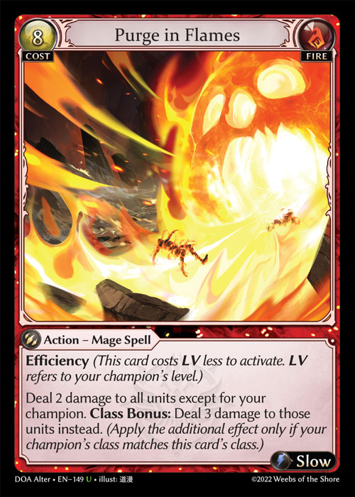
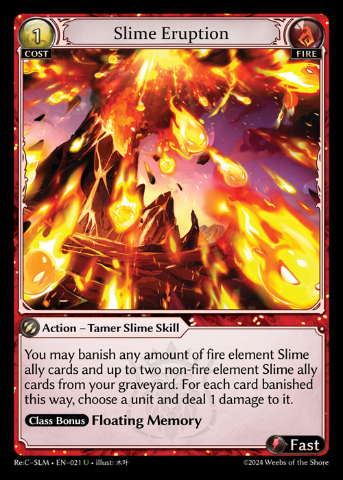

# Game Mechanics - Damage

1. Damage dealt is always calculated at the resolution of an event and is calculated based on all damage-modifying factors.
2. Damage is classified as Combat damage and non-Combat damage. Any damage dealt during the resolution of the damage step of the combat phase is dealt as Combat damage. Non-Combat damage includes most other instances of damage being dealt, such as by action cards or by abilities.
3. Damage can also be characterized as unpreventable damage. This indicates that prevention effects will not be able to prevent that damage.
4. Ally damage is inflicted according to the power stat denoted on the ally card in addition to damage modifiers. Each power stat point on an ally results in one damage dealt per attack point by that ally.
5. Each power stat point on a card in the intent or weapon used during an attack results in one damage per power when a champion attacks. The same is true for any power-increasing modifiers or effects.
6. A champion can declare an attack with more than 0 power. The attack still happens if the power is reduced to 0 or less after the attack was declared and durability from a weapon is removed normally during the damage step.
7. If an effect were to prevent damage, that damage does not happen; it is not simply reduced.
8. No player actions may be taken during the time damage is dealt to units and the time in which those units are determined to be destroyed or banished as a result.
9. Damage is only considered dealt and objects are only considered hit whenever the value of damage taken is greater than 0.
10. The designated object for a damage source will always be the object dealing damage.
    1. For attacks, the damage source is considered to be the attacking unit.
       1. Whenever a champion deals combat damage, it will be considered the sole source of damage regardless of whether it used an attack card, a weapon, or both for the attack.
    2. For actions dealing damage, the action is considered the source of damage.
    3. The object that owns the ability is considered the source of damage for abilities dealing damage.
11. If an effect on a card states to “Deal X damage” where X is a damage value defined by the card, that card marks that much damage on the chosen target.
12. Damage marked on allies is considered “temporary damage” and is removed during the end phase before the start of the next turn.
13. Damage is marked permanently on champions in the form of damage counters which stay until removed by another effect (such as via the Recover mechanic) or until it is equal to or exceeds the life of that champion, at which point that champion dies (this often causes that champion's controller to lose the game).


Champions with Immortality will not die from having damage counters equal to or greater than their life stat.


14. The element typing of a damage source is considered the element of the source.


E.g. If a Luxem, Fire, and Norm element champion attacks with a Water attack card, the damage source typing is only Luxem, Fire, and Norm.


15. Negative amounts of damage can’t be dealt; if less than 0 damage would be dealt, no damage (0 damage) is dealt instead.
16. When damage is dealt, the number of damage instances depends on the wording of the card. If one quantity of damage is applied to a set of objects, it is considered a single damage event for that source. If multiple instances of damage or multiple targets are individually selected, this is considered multiple damage events.


\
\
E.g. Purge in Flames would be considered to deal damage only once while Slime Eruption would be seen as having as many damage instances as the number of times a unit was chosen, even if it was the same unit.


