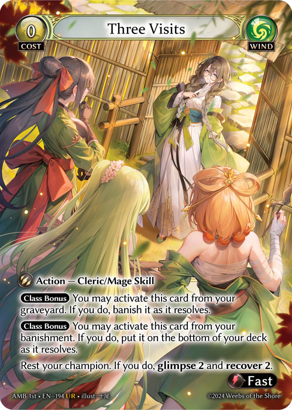

# Game Zones - Public vs Private Information

A public zone is a zone where cards are visible face-up by default (card face is turned up) and a private zone is a zone where cards are visible face-down by default (card face is turned down; card back is face-up).

1. A card’s visibility in a zone may be different from the default visibility in that zone.
2. Cards in zones that are private have no characteristics apart from being cards by default.
   1. If a card with a specified characteristic is added to a private zone, that card must be revealed before it is added to that zone. This does not apply for moving cards to a public zone but with hidden or private information.


\
\
E.g. The Cosmic Bolts generated from Polaris must first be revealed to all players in a game before being shuffled into the Main Deck. This is not true of Quicksilver Grail since the Banishment is a public zone, even though the card added is face-down and considered private.


Face-up cards, their attributes, properties, stats, rules text, and other information are considered public.

A player may look at and examine any face-up cards in a game. If a card is moved this way, it must be returned to the zone it is in and in the same orientation.

Players can’t hide any information about face-up cards or misrepresent information about face-up cards.

All cards in a lineage or similar stack of cards are considered face-up.

Face-down cards are considered private information known only to the player who currently controls that card.

3.  Except for cards in the main deck and unknown face-down cards in banishment, all other face-down cards may be looked at by their controlling player at any time. If an effect banished cards from a zone face-down and gave a specific player certain permissions for that card, such as activation or materialization, those cards are considered private for that player.

    1. When a card becomes private in a public zone (e.g., banishment), and that card was visible to a player due to that card being public information, that player will retain private information about that card and may look at that card. If an ability of that card would grant play permissions, that player can exercise the play permissions on that card.


 &#x20;

\
E.g. If a player who controls Gaia's Blessing and owns Three Visits were to have Three Visits banished by their opponent's Tristan, Shadowreaver, the player who owns Three Visits will still retain the ability to activate it from banishment, as it was previously public information through Gaia's Blessing.


4. If the control of a face-down card changes, neither the owner nor the former controller of that card can look at that card.
5. Face-down cards have no characteristics except for being considered a card.
6. Cards in all zones except for the Main Deck, Material Deck, Memory, and Hand are face-up by default.
