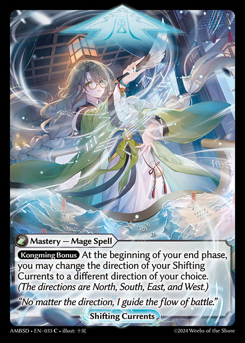
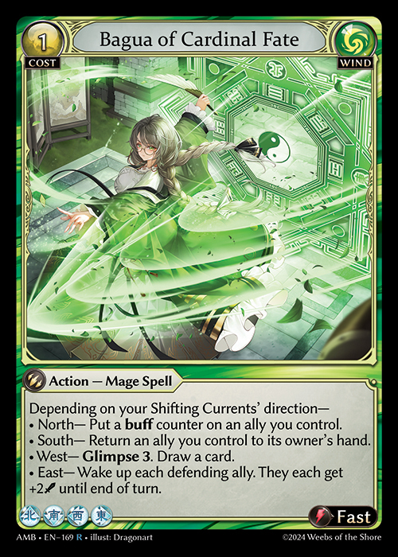

# Game Mechanics - Mastery

Masteries are special non-object player functions and are typically granted by various effects. Players can only have one mastery at a time.

#### General Rules:

1. If you get another mastery, it replaces your current mastery.
2. Cards interacting with certain masteries may have symbols and icons related to that mastery on the card.
3. Cards that track and represent masteries cannot be placed or used in any decks (Main, Material, Sideboard) and only serve to visually reflect the active Mastery.

#### Masteries:

#### Servile Possessions

<figure><figcaption></figcaption></figure>

1. Servile Possessions is a Guardian Skill mastery has a modal triggered ability behind the "Ciel Bonus" restriction ability that says, "Whenever your champion attacks, depending on the number of Omens you have" has different resulting effects:

* 1 or 2 Omens — That attack gets +1 power.
* 3 or 4 Omens — That attack gets +2 power.
* 5 or more Omens — That attack gets +3 power. Draw a card into your memory.

2. The modes for Servile Possessions are mutually exclusive and not additive.
3. The resolving trigger creates a continuous effect that statically applies the attack power bonus.
4. "Omens" refers to any cards in the controlling player's banishment with omen counters on them. Cards will remain omens even if Servile Possessions is lost.

#### Shifting Currents

#### 

1. Shifting currents is a triggered ability that says, "At the beginning of your end phase, you may change the direction of your Shifting Currents to a different direction of your choice." This ability is behind a restriction ability of "Kongming Bonus."
2. Shifting Currents has four modes that may be chosen. Each mode is represented as a "direction" of either North, South, East, or West. Shifting Currents can only be set to one mode at a time, and changing the mode will overwrite the previous mode.
   1. The starting mode is always "North."
   2. Only one mode can be chosen at a time.
   3. If a card's rules text references any of Shifting Currents' modes, it will be reflected as direction icons on the bottom left of the card.
   4. An adjacent direction for shifting currents is defined as the following: North and South are each adjacent to both West and East; West and East are each adjacent to both North and South.

