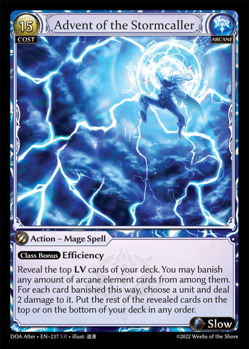

# Ordering and Tracking

#### General Rules

1. If a player is instructed to place a revealed card or a card whose identity/characteristics have become public information in a specific zone, the card will follow the information privacy of the respective zone in which it is placed. E.g., if a card were to be placed third from the top of a deck, the card should be ordered in the deck face down and will remain private. The tracking of cards' positions in this manner is the responsibility of the player(s) who wish(es) to track it.
2. If a player is instructed to simultaneously place two or more cards in a specific place or places in an ordered private zone, such as the Main Deck, the owner of the cards chooses the order and positions they are placed, according to the effect. The owner of those cards and the zone in which they were placed does not reveal the order of those cards to other players, even if the cards were previously public information.
   1. If an effect were to reveal or change the visibility of a specific card or cards from among those in order that was changed in some way, the visibility and information will only be considered after the effect of ordering is fully completed.
3. If a player is instructed to simultaneously place two or more cards randomly within an ordered private zone, the owner of the cards must first shuffle any of the revealed or seen cards and assign them randomly within the zone. Neither the owner nor other players in the game should know the identity or identities or any card(s) that were positioned accordingly.


.png>)\
\
E.g., For Advent of the Stormcaller, even though the top **LV** cards are revealed to all players in a game, only the controlling player will see the way the cards get ordered into the deck. The other players may only know how many cards were positioned to either the top or the bottom, but they are not allowed information as to which cards were placed where and in what order. Similarly, for Angelic Channeling, even though the cards were public in Banishment, opponents will not know the order of the cards (if it was two or more).


