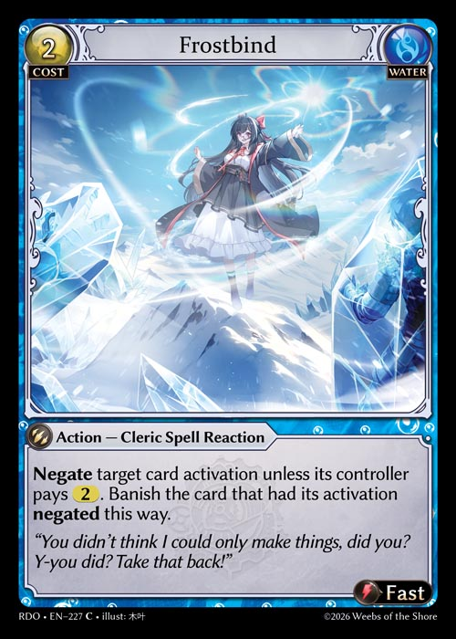

# State-based Checks and Effects

State-based effects occur as a result of conditions in the state of the game being met and often do not require any additional input from the player to be completed.

#### General Rules:

1. Checks to see if state-based conditions are met happen every time the state of the game changes in the time between a player losing or passing Opportunity and the moment at which another player receives Opportunity.
2. The target of an activation, materialization, or trigger will be changed to no target or a null target if the previously assigned target becomes illegal or does not exist during state-based checks.
   1. If all required targets of an activation, materialization, or trigger do not exist or are illegal, that activation, materialization, or trigger will fizzle.

#### Types of Checks

1. Game-ending Checks: The game will first make a pass to validate whether any conditions that result in a player having won or lost a game are to be checked.
2. Damage: If the damage marked on a unit equals or exceeds a unit's life stat, the unit will die.
3. Durability: If a weapon has no durability counters, the weapon will be destroyed.
4. Unique Objects: If a player controls 2 or more unique objects with the same name, the game will force the player to choose one of them to keep, and the player must sacrifice the rest of those objects before the game continues.
5. Copy: If a copy of a card activation is sent to a zone other than the Effects Stack, it will cease to exist unless it has a corresponding card. If a copy of an object is sent to a zone other than the field, it will cease to exist unless the copy has a corresponding card.
6. Clean-Up: The game will remove all ally damage counters, “until end of turn” or one-shot effects, and other temporary conditions at the end of each turn, such as a player's Agility. If any limitations are placed on players, such as maximum hand sizes, the active player must take the necessary actions to fulfill such limitations before the game continues.
7. Combat Roles:  A defending unit is no longer a defender/defending unit as soon as it is no longer an attack target. A retaliating unit stops being a retaliating unit when it no longer has a valid retaliation target.
8. Resolution: As a card activation/materialization/bestowment resolves, it will check to see if the source of that resolving instance has any other instances (copies or a non-copy) pending resolution. If there are no remaining instances, the card will be removed from the Effects Stack and moved to its corresponding zone. If the final resolving instance of an object-based card type is the non-copied instance, the card will be moved to the field to represent that object.
9. Activations/Materializations/Bestowments: While an activation/materialization/bestowment is pending resolution, the game will check legality for its resolution, including the presence of its source card in the effects stack. If that activation/materialization/bestowment doesn't have its corresponding source card, it will fizzle.


\
\
E.g., If Frostbind banishes the card that is a source for one or more card activations that are pending resolution, each of those instances will Fizzle as a result of the state-based checks that occur after Frostbind resolves and banishes that card.

