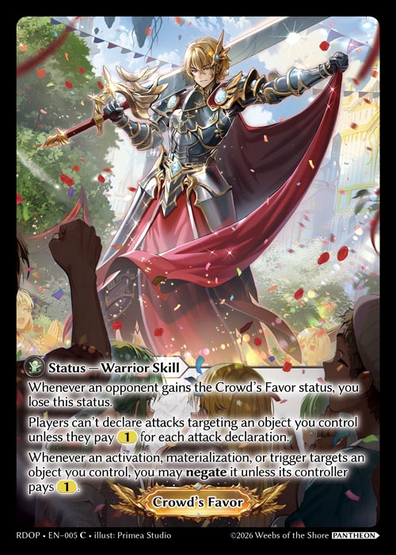

# Game Mechanics - Statuses

Statuses, like Masteries, are special non-object player functions and are typically granted by various effects. Unlike Masteries, a player can have multiple Statuses at the same time, but can only have one instance of any given status.

#### General Rules:

1. Cards that track and represent statuses cannot be placed or used in any decks (Main, Material, Sideboard) and only serve to visually reflect the active status.
2. Statuses are lost or gained and this can be visually represented by a token or card that represents that status.

#### Crowd's Favor

&#x20;

Crowd's Favor is a status generated by cards in the Pantheon format with the following rules:

1. Whenever an opponent gains the Crowd's Favor status, you lose this status.
2. Players can't declare attackcs targeting an object you control unless they pay 1 (reserve) for each attack declaration.
3. Whenever an activation, materialization, or trigger targets an object you control, you may negate it unless its controller pays 1 (reserve).

