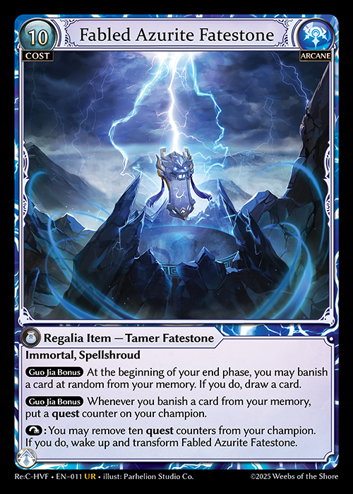

# Double-faced Cards

In Grand Archive, some cards exist that have two faces, or two sides, each with separate characteristics as opposed to a single side of information and rules text with an information-less card back. There is only one type of double-faced card in Grand Archive, currently.

General Rules:&#x20;

1. Double-faced cards have no card back and instead have another full card face with characteristics and rules text.  The default cost symbols of the card are replaced such that the reserve or memory cost icon reflects which side of the card is being examined, in addition to an embossed upward-pointing arrow in the bottom left of the card.
   1. The "default side" of a card is represented by the default appearance of the cost icons located on the top left of the card. This is noted by solid cost bubbles, either yellow for reserve or blue for memory. It will also be absent of the downward-pointing arrow found on the flip side.
   2. The side of the card that replaces the regular Grand Archive card back is the "flip side." The flip sid**e** is denoted by the embossed downward-pointing arrow in the reserve or memory cost bubble, in addition to a solid downward-pointing arrow on the bottom left of its text box.
2. To flip a card to another side during a game, the rules text will typically tell a player to "transform" the card as a player action. Transform is the player action that means to flip a card to the other side. &#x20;
3. Double-faced cards must be played on their "default side" initially. This side is represented by the typical reserve and memory cost icons found on regular, non-double-faced cards. The side with the modified symbol (shown by an embossed arrow on "Fatebound" or "Fatestone"-subtyped cards printed in Abyssal Heaven) can't be played. If a card is currently on its flip side on the field, it is considered "transformed" (and has the transformed property).
4. Only the characteristics (rules text, abilities, stats, name, type, etc.) on the face-up side are considered for game actions and evaluating the game state. While not on the field, only the default side of the card is considered for characteristics in all other zones.
   1. If a transformed double-faced card is moved from the field to any other zone, it must be physically flipped back to the default side. Last-known information will still consider any characteristics of the transformed side, if applicable.
   2. If a transformed double-face card has a different type than the type on the default side that would change the rules about which zone it would be moved to, it would move to the zone corresponding with the appropriate rules applied to the default side of the card.


E.g., If Seiryuu, an ally with a reserve cost is destroyed by any effect, the default side of the card, Fabled Azurite Fatestone, is examined when determining which zone the card would be placed in. In this context, "Seiryuu" would be placed in Banishment, flipped back to its default side as the Fatestone. Similarly, if an effect attempts to move Seiryuu to the hand, memory, or main deck, it will instead be returned to the material deck as Fabled Azurite Fatestone, a regalia item.\
\
\



5. If a player has knowledge permissions associated with a double-faced card (i.e., that card is either public or private to that player) they may examine either side of the card by flipping it.
6. Flipping it in this way will not be considered a transformation.
7. If a double-faced card is copied, only the characteristics of the present side are copied.
   1. &#x20;If a card copies the characteristics of a transformed card, the copy will share the characteristics of that card in its transformed state.
   2.  Copies of double-faced cards cannot themselves transform. If a player attempts to transform a copy of a card that is either transformed or can be transformed, nothing will happen, and the action is skipped. Any costs paid will not be "refunded."


\
\
E.g., If a player banishes a Clockwork Amalgam that has copied Suzaku, a transformed ally, and opts to pay for the On Banish ability, Clockwork Amalgam will stay banished as it is not itself a double-faced card and can't transform.


8. Double-faced cards can still be considered "face-down." In this situation, a placeholder card with a default Grand Archive card back should be used to represent the card. A face-down double-faced card will not be considered transformed, will have no characteristics other than being a card, and should be treated as a non-double-faced Grand Archive card. The use of opaque sleeves are suitable for hiding the back of a double-faced card, and the opaque card back may be used to treat the card as "face-down."
9. Transforming a double-faced card does not cause it to become a new object, however, any static abilities that are now active as a result of the transformation will receive a new timestamp.
   1. Any continuous effects that previously applied to the default side, will continue to apply to the transformed card, if applicable.
10. When choosing a card name for any effects, the name of the transformed card may be used. Only cards with the chosen name will have that effect applied to them, regardless of the name on the other side of the card.


It is recommended that players use opaque card sleeves when playing with double-faced cards to represent them as face down with a uniform card back applied to a deck. This is **mandatory** in a tournament setting.


