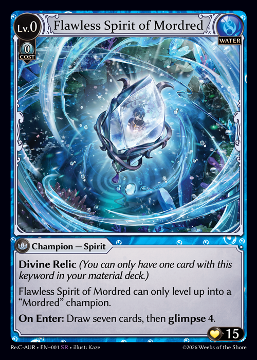
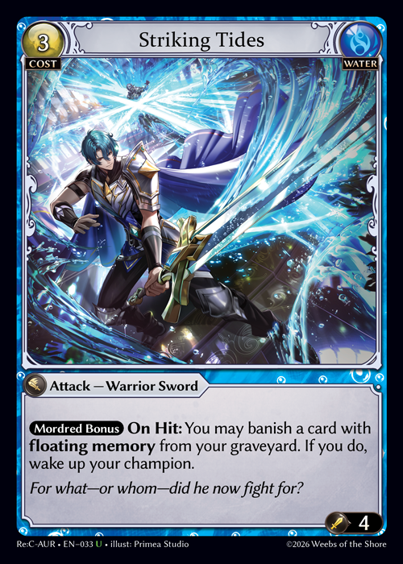

# Parts of a Card - Name

The name of the card will be found in the middle section of the top bar between the card cost and the card element.

General Rules:

1. Card names are unique.
2. If a card must be named or a card of a chosen name is specified for an effect, the full name of the card must be specified.
3. Shortcutting the name of the card can be achieved if the intended card to be named can be sufficiently described such that each player in the game understands the card intending to be named without ambiguity. If shortcutting is not possible due to a lack of mutual understanding, the player naming a card will provide the full name of the intended card. (Players can use the Index for assistance at any time.)
4. The corresponding card may be indicated or represented in the Index.
5. Champion names follow certain conventions and rules:
   1. A champion's name is established under the convention of \[Name], \[Title]. Champion cards that share a Name identifier are all considered to be a champion of that name. E.g., Rai, Spellcrafter and Rai, Storm Seer are both Rai champions, even though their Titles are difference.
      1.
      2. If leveling a champion requires them to follow a named lineage, they may only level up from a previous level champion of that name. Lineages follow the convention of \[Name] Lineage on champion cards. If a lineage ability specifies a non-named champion, it must do so by specifying the entire name. E.g., Rai, Archmage that has the Rai Lineage keywords can only be leveled into if the player has a lower level corresponding Rai champion. However, Mordred, Burnished Avenger that has the Flawless Spirit of Mordred Lineage must specify the entire name of the card \[Flawless Spirit of Mordred] since it is not a named champion.
      3. Champions Bonus restriction abilities will use a champion's name for determining when the restriction ability is unlocked. The restriction ability follows the convention of \[Name] Bonus.
      4. Champions that have the Name of a champion card somewhere in their name do not receive the benefit of being a named champion for the purposes of naming conventions, such as for restriction abilities or lineages.


\
\
Striking Tides will not have its restriction ability active if the player only controls Flawless Spirit of Mordred.


