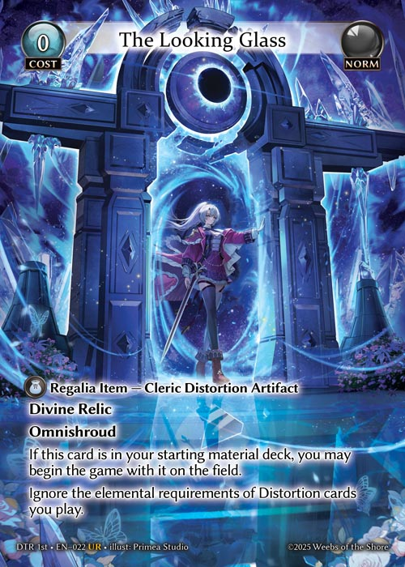

# General Rules - Starting the Game

Step 1: Each player places their material deck and main deck in the appropriate zones

Step 2: Each player shuffles their main deck to ensure it is sufficiently randomized

Step 3: Players present their main decks to their opponents to shuffle and/or cut

Step 4: Players determine the first turn player. This may be done through any random method that all players agree to.

Step 5: In turn order, players perform any pre-game actions.


&#x20;

E.g., Cards like The Looking Glass have abilities that allow players to begin the game with it on the field. Before a player would take their first turn, they would be allowed to acknowledge the ability as a special game action and place this card on the field. When the game begins, it will treat this card as having been in play before the first turn.


Step 6: The first player takes their first turn.

### Turn One

1. Each player’s first turn follows a modified turn order: The turn player skips their Wake Up, Materialize, and Recollection phases, and places a Level 0 champion from the Material Deck onto the field.
2. In a two-player game, the first turn player also skips their Draw Phase.
