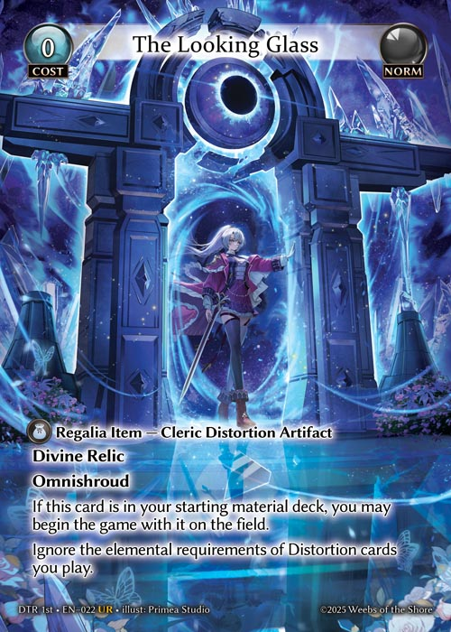

# General Rules - Starting the Game

### Standard Games

1. Each player places their material deck and main deck in the appropriate zones
2. &#x20;Each player shuffles their main deck to ensure it is sufficiently randomized
3. &#x20;Players present their main decks to their opponents to shuffle and/or cut
4. Players randomly determine the first turn player. This may be done through any randomization method that all players agree to.
5. In turn order, players perform any pre-game actions.
6. All players will reveal their starting Lv 0 champion from their respective material decks and place them onto the field. In turn order, players will resolve the On Enter abilities for obtaining their starting hands. Players can't gain the [Opportunity](../game-mechanics/game-mechanics-timing-and-permissions.md) to perform player actions until all of these abilities are resolved.
7. &#x20;The first player takes their first turn.


&#x20;

E.g., Cards like The Looking Glass have abilities that allow players to begin the game with it on the field. During step 5, they would be allowed to acknowledge the ability as a special game action and place this card on the field. When the game begins, it will treat this card as having been in play before the first turn.


#### Standard Games - Turn One

1. Each player’s first turn follows a modified turn order: The turn player skips their Wake Up, Materialize, and Recollection phases.
   1. Unless the turn player is the last one in the first turn cycle, they may not attack. E.g., in a two-player game, the second player is the last player in that first turn cycle and therefore may declare attacks.
2. In two-player game, the first turn player also skips their Draw Phase.

### Pantheon Games

1. Each player places their material deck and main deck in their appropriate zones. Players will also place their Lesser and Greater Boons in their respective Pantheon zones.
2. Each player shuffles their main deck to ensure it is sufficiently randomized
3. Players present their main decks one of their opponents to shuffle and/or cut
4. Players randomly determine the first turn player. This may be done through any randomization method that all players agree to. With more than two players, Pantheon player turn order is decided by going clockwise from the first turn player.
5. In turn order, players perform any pre-game actions.
6. All players will reveal their starting Lv 0 champion from their respective material decks and place them onto the field. In addition, each player puts a Pantheon Barrier token into play.  In turn order, players will resolve the On Enter abilities for obtaining their starting hands. Players can't gain the [Opportunity](../game-mechanics/game-mechanics-timing-and-permissions.md) to perform player actions until all of these abilities are resolved.
7. The first player takes their first turn, starting with the Draw Phase.

#### Pantheon Games - Turn One

1. Each player’s first turn follows a modified turn order: The turn player skips their Wake Up, Materialize, and Recollection phases. Unlike Standard matches, the first turn player draws a card during their Draw Phase.
2. Unless the turn player is the last one in the first turn cycle, they may not attack. E.g., in a four-player game, the fourth player is the last player in that first turn cycle and therefore may declare attacks.
